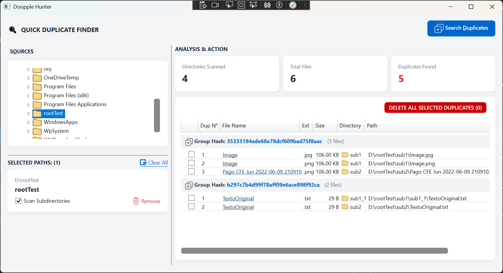

# DopplerHunter

## Description

**Dopple Hunter** is a fast, lightweight desktop application designed to scan, detect, and manage duplicate files across your system. It helps you reclaim disk space and keep your storage organized by accurately grouping identical files using content-based hash analysis.

### 🚀 Key Features

 - Smart Hash Grouping: Automatically categorizes identical files into distinct visual groups for effortless review before taking action.
 - Flexible Directory Scanning: Add multiple target paths and include or exclude subdirectories while preventing duplicate processing of the same files.
 - Batch Selection: Quickly select duplicate copies across groups with a single click while keeping the original file safe.
 - Visual Inspection & Filters: Filter results by file extensions, view parent folders with clean UI indicators, and open file locations directly.
 - Resource-Efficient: Built to handle large volumes of files with minimal CPU and memory overhead.

### 🛠️ Built With

    Language: C#
    Framework: .NET / WPF (Windows Presentation Foundation)
    Architecture: MVVM Pattern (Model-View-ViewModel) 